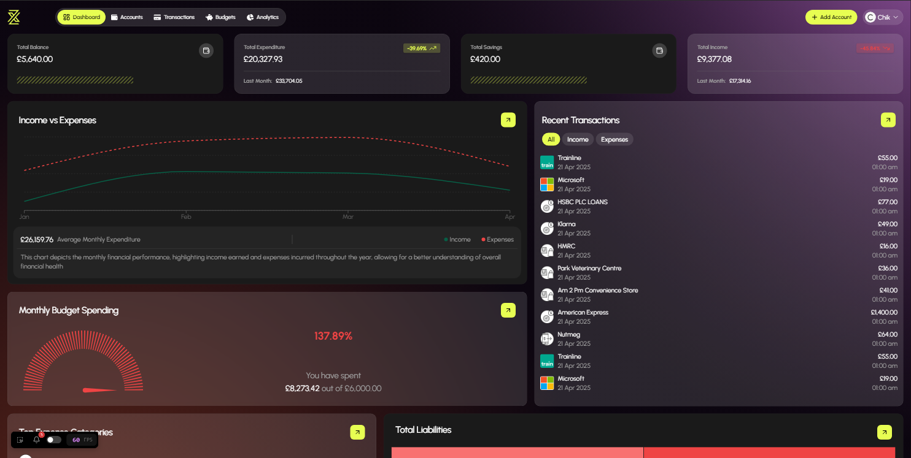
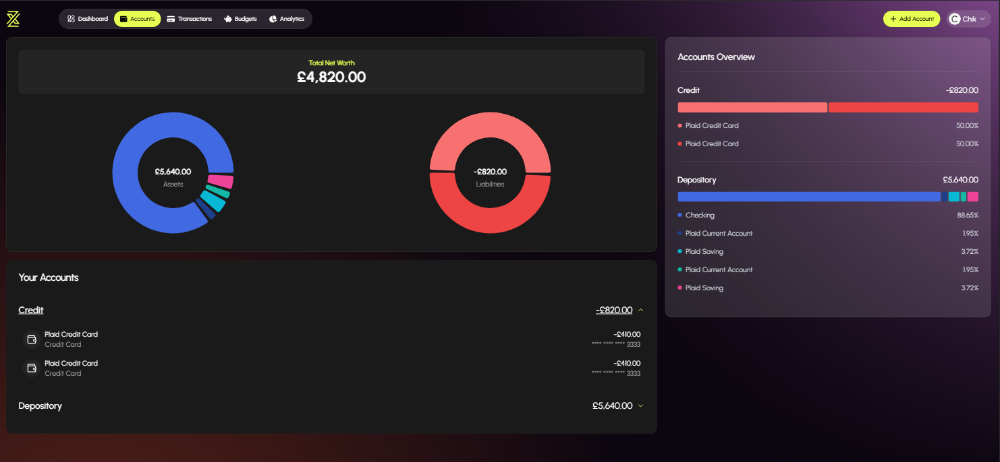
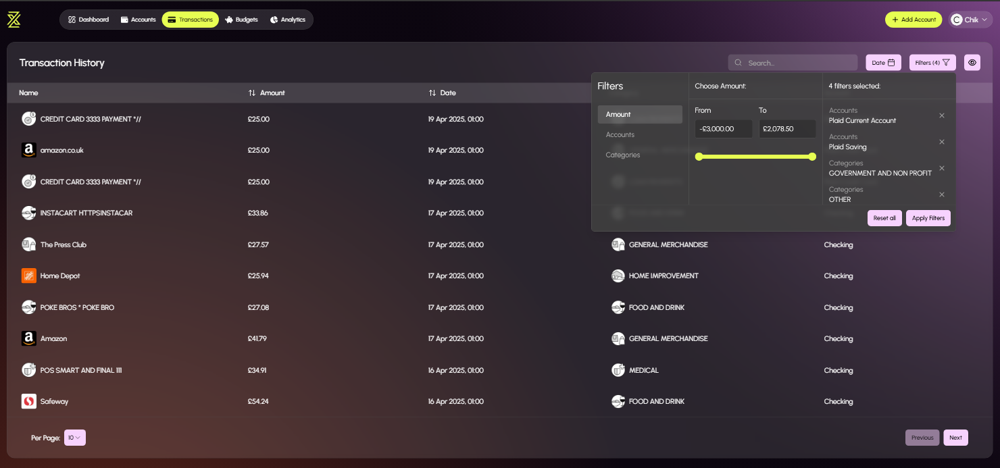
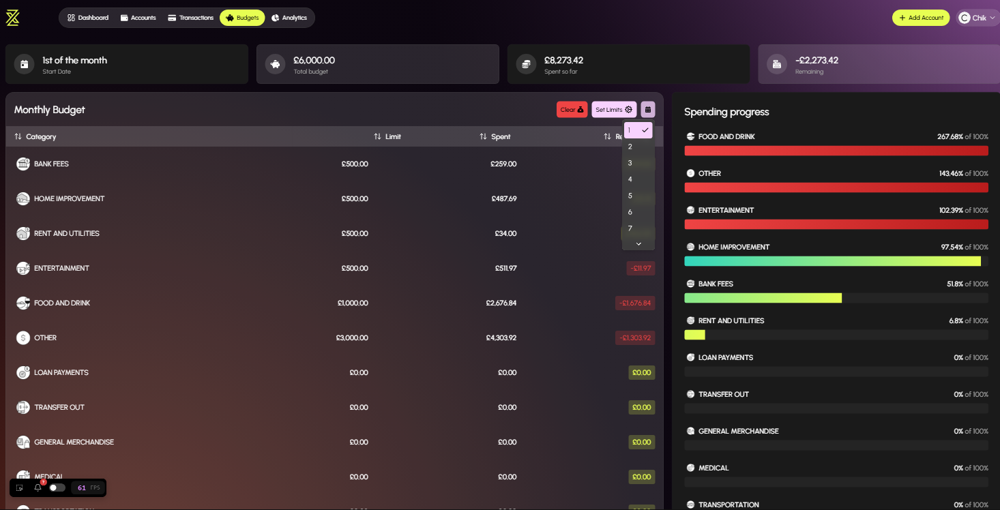
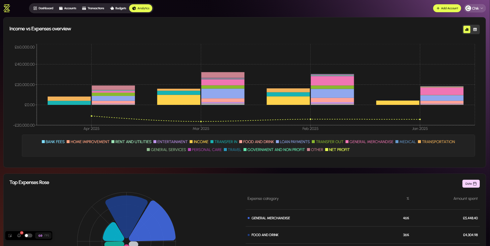
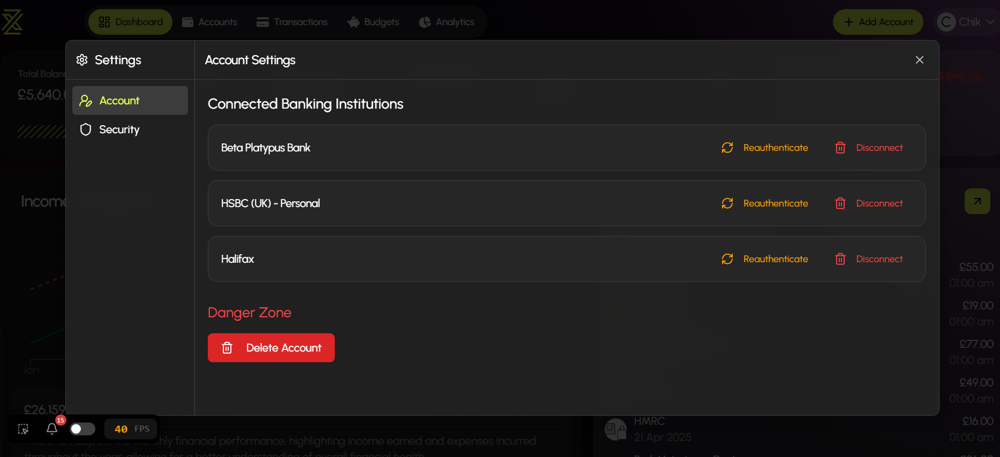

# ZenWealth

A comprehensive personal finance management application that provides insights on financial transactions and helps users create and manage budgets.

## Overview

ZenWealth is built with ASP.NET Core (backend) and React (frontend). The application enables users to:

- Track and visualize income vs expenses
- Connect to banking institutions via Plaid
- Manage multiple accounts (checking, savings, credit cards)
- Create and monitor budgets by category
- Analyze spending patterns through detailed analytics
- View transaction history with filtering capabilities
- Calculate net worth based on assets and liabilities

## Features

### Dashboard
The dashboard provides an overview of financial status including total balance, expenditure, savings, and income.


### Accounts
View and manage all connected financial accounts including bank accounts, credit cards, and savings accounts.


### Transactions
Review transaction history with advanced filtering options by date, amount, account, and category.


### Budgets
Create and manage monthly budgets by category with visual indicators of spending progress.


### Analytics
Analyze spending patterns and income vs. expenses over time with detailed visualizations.


### Settings
Manage connected banking institutions and account security settings.



## Technology Stack

- **Backend**: C# with ASP.NET Core & Going.Plaid
- **Frontend**: TypeScript with React, Shadcn & Tailwind CSS
- **Database**: SQL Server
- **External Services**: 
  - Plaid API for bank connections
  - Azure Communication Services for email notifications

## Prerequisites

- [.NET 8.0+](https://dotnet.microsoft.com/download)
- [Node.js 23.0+](https://nodejs.org/)
- [SQL Server](https://www.microsoft.com/en-gb/sql-server/sql-server-downloads) or [PostgreSQL](https://www.postgresql.org/)
- [A Plaid developer account](https://dashboard.plaid.com)
- [An Azure Account](https://azure.microsoft.com/en-gb/products/communication-services)

## Installation

1. Clone the repository
   ```
   git clone https://github.com/Chixide1/ZenWealth
   cd Zenwealth
   ```

2. Set up the backend
   ```
   cd Server
   dotnet restore
   ```

3. Set up the frontend
   ```
   cd Client
   npm install
   ```

4. Configure the application (see Configuration section below)

5. Run the application
   ```
   # In the Backend directory
   dotnet run
   
   # In a separate terminal, in the Frontend directory
   npm start
   ```

## Configuration

Copy the below json to `appsettings.json` and update the values:

```json
{
    "Logging": {
        "LogLevel": {
            "Default": "DEFAULT_LOG_LEVEL",
            "Microsoft.AspNetCore": "ASP.NET_CORE_LOG_LEVEL",
            "Microsoft.EntityFrameworkCore.Database.Command": "EF_CORE_LOG_LEVEL"
        }
    },
    "DatabaseProvider": "PostgreSql",
    "ConnectionStrings": {
        "DefaultConnection": "DATABASE_CONN_STR",
        "AzureCommunicationServices": "AZURE_COMMS_SERVICE_CONN_STR",
        "PostgreSqlConnection": ""
    },
    "AllowedHosts": "HOSTNAME",
    "Plaid": {
        "ClientID": "PLAID_CLIENT_ID",
        "Secret": "PLAID_SECRET",
        "WebhookUrl": "PLAID_WEBHOOK_URL"
    },
    "EmailSettings": {
        "SenderEmail": "AZURE_COMMS_SERVICE_SENDER_EMAIL",
        "FrontendBaseUrl": "FRONTEND_URL"
    }
}
```

### Configuration Values

- **Logging**:
  - `DEFAULT_LOG_LEVEL`: General logging level (e.g., "Information")
  - `ASP.NET_CORE_LOG_LEVEL`: Logging level for ASP.NET Core components (e.g., "Warning")
  - `EF_CORE_LOG_LEVEL`: Logging level for Entity Framework Core (e.g., "Information")

- **DatabaseProvider**: The database provider you want to use. Available options are Sql Server & PostgreSQL

- **ConnectionStrings**:
  - `DefaultConnection`: Connection string if you're using SqlServer
  - `AzureCommunicationServices`: Connection string for Azure Communication Services
  - `PostgreSqlConnection`: Connection string if you're using PostgreSQL

- **AllowedHosts**: Hostname where the application will run (e.g., "localhost" or your domain)

- **Plaid**:
  - `ClientID`: Your Plaid client ID
  - `Secret`: Your Plaid secret
  - `WebhookUrl`: URL for Plaid webhooks (for transaction updates)

- **EmailSettings**:
  - `SenderEmail`: Email address used for sending notifications
  - `FrontendBaseUrl`: Base URL of your frontend application (for links in emails)

## Infrastructure as Code (Terraform)

ZenWealth uses **Terraform** to manage Azure infrastructure, including:
- Azure Resource Groups
- Azure Communication Services (for email notifications)
- Azure Email Communication Services with custom domain management

### Prerequisites

- [Terraform CLI](https://www.terraform.io/downloads) (v1.0+)
- [Azure CLI](https://docs.microsoft.com/cli/azure/install-azure-cli)
- An Azure subscription with appropriate permissions

### Terraform Setup

#### 1. Authenticate with Azure

```bash
az login
```

This opens a browser to authenticate. Alternatively, use a service principal by setting environment variables:
```bash
$env:ARM_CLIENT_ID = "your-client-id"
$env:ARM_CLIENT_SECRET = "your-client-secret"
$env:ARM_SUBSCRIPTION_ID = "your-subscription-id"
$env:ARM_TENANT_ID = "your-tenant-id"
```

#### 2. Configure Backend State

Edit `backend.tfvars` with your Azure Storage Account details:

```hcl
resource_group_name  = "standard"            # Resource group containing the storage account
storage_account_name = "ckmainsa"           # Storage account name (must be globally unique)
container_name       = "tfstate"            # Blob container for state
key                  = "prod/zenwealth.tfstate"  # Path to state file
```

**Do not commit `backend.tfvars` to version control** — it is already in `.gitignore`.

#### 3. Initialize Terraform

From the repository root:

```bash
terraform init -reconfigure -backend-config=backend.tfvars
```

This initializes the local Terraform working directory and configures the remote backend in Azure Storage.

#### 4. Plan and Apply Infrastructure

**View planned changes:**
```bash
terraform plan
```

**Apply the infrastructure:**
```bash
terraform apply
```

Review the changes and type `yes` to confirm.

### Terraform Files

- **`main.tf`** — Provider configuration and Azure Resource Group
- **`communications.tf`** — Azure Communication Services and Email Service resources
- **`variables.tf`** — Input variable definitions
- **`terraform.tfvars`** — Azure authentication variables (do not commit)
- **`backend.tfvars`** — Remote backend configuration (do not commit)
- **`output.tf`** — Output values (e.g., email verification records, connection strings)

### Destroying Infrastructure

To remove all Azure infrastructure:

```bash
terraform destroy
```

**⚠️ Warning:** This will delete all resources defined in Terraform. Be sure you have backups of any important data.

## Environment Variables

- `VITE_ASPNETCORE_URLS`: The Api URL which will be referenced by the frontend application.
- `ASPNETCORE_ENVIRONMENT`: The enviroment which the Api should run under (e.g., "Development", "Production")